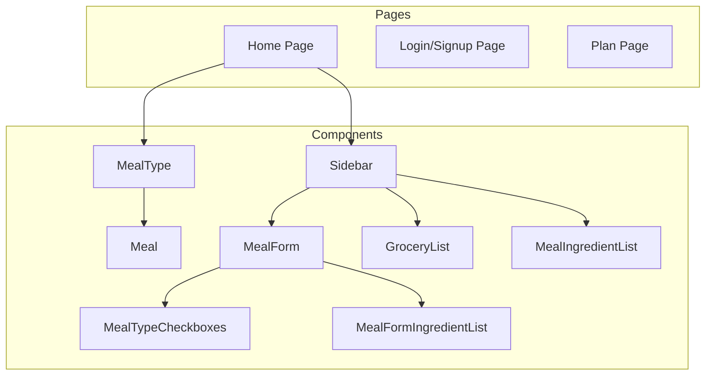

```mermaid
graph TD
  A[Home Page] --> B[MealType]
  A --> C[Sidebar]
  B --> I[Meal]
  C --> D[MealForm]
  C --> E[GroceryList]
  C --> F[MealIngredientList]
  D --> G[MealTypeCheckboxes]
  D --> H[MealFormIngredientList]

  AA[Login/Signup Page]
  
  AAA[Plan Page]

  subgraph Pages
    A
    AA
    AAA
  end

  subgraph Components
    B
    C
    D
    E
    F
    G
    H
    I
    

  end

```